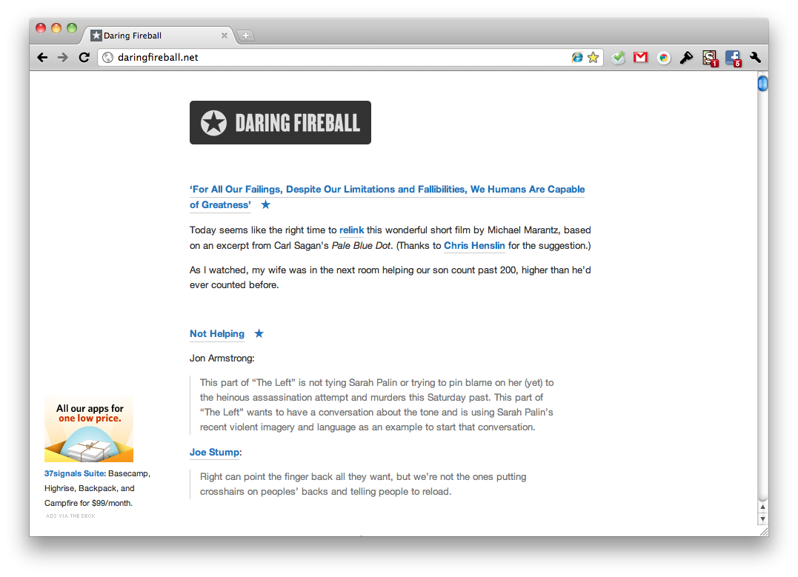

# Simpler Daring Fireball userstyle

Improves contrast and readability, by inverting the color scheme, increasing the font-size, and widening the column, all without removing the ads. This is purely maintained out of personal preference as light-on-dark sites tend to hurt my eyes.

## Notes

Feedback, comments, and bugs can be filed via Issues.

## Disclaimer

This is a quick little side project. I reserve the right to change anything at anytime, so keep that in mind when installing. I cannot offer technical support for installing user styles either; just Google for "[browser] userstyles" and you should be set.
